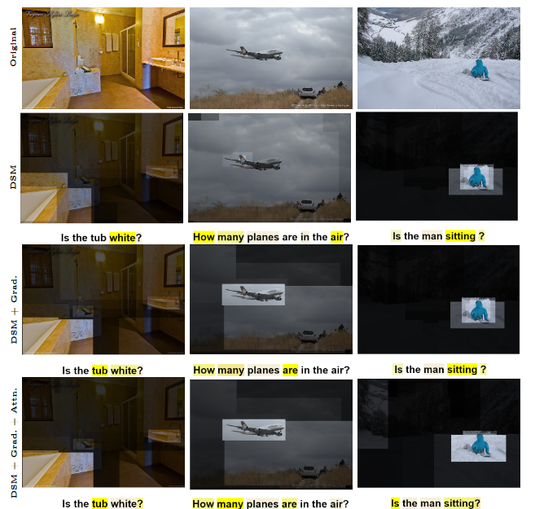

# Interpretable Visual Semantic Alignment via Spectral Attribution

Our work specifically focuses on generating visual explanations of both the image modality and the text modality using concepts from graph spectral theory by solving the characteristic equation of the Laplacian for models that are fine-tuned on the VQA downstream task. Our method is model-agnostic to some extent and post-hoc, capable of generating local explanations catering to each image-question pair provided for inference.
The job of our interpretability module is to highlight the regions of image and text (question) that contribute to the model’s decision/answer. We propose the following list of contributions for interpretability of bi-modal models:
1. **Class-agnostic version (Deep Spectral Methods for Interpretability - DSMI):** The first is the direct application of graph spectral theory which is unsupervised in nature

2. **Class-specific version (DSMI + Grad):** In order to explain the decision of the bi-modal models, we modeled the spectral approach like GradCAM, where "CAM" represents the fiedler eigenvectors generated by the standard spectral approach which are much more robust than pure attention maps

3. **Class-specific and Transformers-specific version (DSMI + Grad + Attn):** In combination with the gradients based spectral approach, we utilise the attention maps for transformer specificit


## Demo
```bash
git clone https://github.com/shiv2110/Transformer-spectral-interpretability.git
cd Transformer-spectral-interpretability
pip install -r requirements.txt
```

```bash
python demo_vqa.py --image-path <path_to_image> --question <question_for_image> --method-name <interpretability_method>
```




## Running Perturbation Tests

Download VQA 2.0 validation dataset

https://visualqa.org/download.html

Download COCO [2014 val images](http://images.cocodataset.org/zips/val2014.zip), , annotations ([val](https://s3.amazonaws.com/cvmlp/vqa/mscoco/vqa/v2_Annotations_Val_mscoco.zip)), and questions ([val](https://s3.amazonaws.com/cvmlp/vqa/mscoco/vqa/v2_Questions_Val_mscoco.zip))

    root
    ├── val2014              
    |   ├── COCO_val2014_000000000042.jpg
    |   └── ...  
    ├── v2_OpenEnded_mscoco_val2014_questions.json
    └── v2_mscoco_val2014_annotations.json

Download valid.json
```bash
cd data/vqa
wget https://nlp.cs.unc.edu/data/lxmert_data/vqa/valid.json
```

Running positive image perturbation test
```bash
python perturbation.py --COCO_path <path_to_COCO_samples> --method <interpretability_method> --is-positive-pert True
```

Running negative image perturbation test
```bash
python perturbation.py --COCO_path <path_to_COCO_samples> --method <interpretability_method> 
```

Running positive text perturbation test
```bash
python perturbation.py --COCO_path <path_to_COCO_samples> --method <interpretability_method> --is-text-pert True --is-positive-pert True
```

Running negative text perturbation test
```bash
python perturbation.py --COCO_path <path_to_COCO_samples> --method <interpretability_method> --is-text-pert True
```

AUC scores for perturbations tests on LXMERT: Lower AUC for positive tests and higher AUC for negative tests indicates better performance

| Method                                       | Image ve+                 | Image ve-                | Text ve+                | Text ve-                |
|----------------------------------------------|---------------------------|--------------------------|--------------------------|--------------------------|
| Hila Chefer Relevance Maps                           | 51.01                 | 62.91                | 21.57                | 48.31                |
| Transformer Attribution                  | 52.80                 | 61.16                    | 21.89                | 47.80                |
| LRP                                    | 52.83                   | 60.82                    | 24.14                    | 44.51                    |
| Raw Attention                                | 54.36                     | 61.34                    | 32.77                    | 37.40                    |
| Grad-CAM                                 | 57.97                     | 59.59                    | 34.50                    | 37.56                    |
| Rollout                                  | 57.15                     | 58.26                    | 38.71                    | 31.47                    |
| DSMI                         | 53.47                     | 59.13                    | 28.67                    | 40.28                    |
| DSMI + Grad                  | 53.77                     | 62.28                | 24.78                    | 44.80                    |
| DSMI + Grad + Attn      | 53.42                     | 62.23                  | 24.12                  | 45.47                  |


## DSMI + Grad. Explanations for CLIP


## Credits

- Implementation of baselines is based on [Relevance Maps](https://github.com/hila-chefer/Transformer-MM-Explainability)
- Core DSMI implementation is based on [Deep Spectral Methods for unsupervised localisation and segmentation](https://github.com/lukemelas/deep-spectral-segmentation)
- LXMERT implementation is based on the [offical LXMERT](https://github.com/airsplay/lxmertimplementation) and on [Hugging Face Transformers](https://github.com/huggingface/transformers)
- CLIP implementation is based on the [official CLIP](https://github.com/openai/CLIP) implementation.

## Cite Us

```bibtex
@InProceedings{10.1007/978-3-031-78395-1_9,
author="Ambati, Shivanvitha
and Padmanabhan, Vineet
and Bhukya, Wilson Naik
and Prasad Lal, Rajendra",
editor="Antonacopoulos, Apostolos
and Chaudhuri, Subhasis
and Chellappa, Rama
and Liu, Cheng-Lin
and Bhattacharya, Saumik
and Pal, Umapada",
title="Interpretable Visual Semantic Alignment via Spectral Attribution",
booktitle="Pattern Recognition",
year="2025",
publisher="Springer Nature Switzerland",
address="Cham",
pages="129--143",
abstract="The initial Transformer architecture which was introduced for text, has been extended to image, speech and other domains. Multimodal models which combine more than one kind of data, and vision-language models in particular, have also seen increasing adoption. The interpretability of these models is crucial due to their potential for subtle errors and their diverse applications. Existing interpretability methods for Transformers primarily employ attention maps to explain vision-language alignment. This overlooks the contribution from other parts of the transformer block like Layer Normalization and Feed-Forward Network (FFN) and can lead to incorrect image and text segment attribution to the model's decision. We propose an approach that mitigates this issue by using the output of the transformer modules instead of attention maps as the basis for deriving the interpretability vectors. We use Spectral Graph Theory and propose three variants of our method, namely: DSMI (Deep Spectral Method for Interpretability), DSMI + Grad (DSMI with gradients) and DSMI + Grad + Attn (DSMI with gradients {\&} attention maps). Each version has its own advantages with varying performance based on the class of models which are being analyzed. We show with detailed experiments that our methods are superior to some of the existing interpretability techniques such as GradCAM and have comparable interpretability to methods like LRP and other state-of-the-art methods while being simpler to implement.",
isbn="978-3-031-78395-1"
}
```
